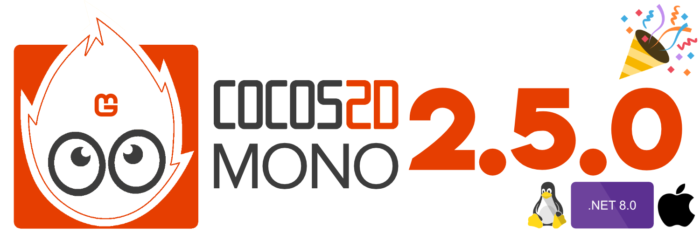

Cocos2D-Mono 2.5.0 is out now! Go check out the [release notes](https://github.com/brandmooffin/cocos2d-mono/releases/tag/2.5.0) to see what's change...or just read below. 

There's also a lot of news to take a look at too!

## What's Changed
    - Upgrade to .NET 8
    - Support for MonoGame 3.8.2
    - Linux platform support
    - macOS platform support
    - Removal for UWP platform
    - Support for iOS 18
    - Support for Android 34
    - Fixes for DesktopGL crashing when using System Label for Linux & macOS
    - Null reference check in CCNode.Visit()
    - CCDrawManager reset width & height on Init
    - Remove early config init during CCLabel init
    - Add method to set atlas texture size for CCLabel

**Full Changelog**: https://github.com/brandmooffin/cocos2d-mono/compare/2.4.8...2.5.0

NuGet Packages:

  - Android: [Cocos2D-Mono.Android](https://www.nuget.org/packages/Cocos2D-Mono.Android/)

  - DesktopGL (Windows, Linux, macOS): [Cocos2D-Mono.DesktopGL](https://www.nuget.org/packages/Cocos2D-Mono.DesktopGL/)

  - iOS: [Cocos2D-Mono.iOS](https://www.nuget.org/packages/Cocos2D-Mono.iOS/)

  - Linux: [Cocos2D-Mono.Linux](https://www.nuget.org/packages/Cocos2D-Mono.Linux/)

  - macOS: [Cocos2D-Mono.macOS](https://www.nuget.org/packages/Cocos2D-Mono.macOS/)

  - Windows: [Cocos2D-Mono.Windows](https://www.nuget.org/packages/Cocos2D-Mono.Windows/)

  - Core Android: [Cocos2D-Mono.Core.Android](https://www.nuget.org/packages/Cocos2D-Mono.Core.Android/)

  - Core DesktopGL: [Cocos2D-Mono.Core.DesktopGL](https://www.nuget.org/packages/Cocos2D-Mono.Core.DesktopGL/)

  - Core iOS: [Cocos2D-Mono.Core.iOS](https://www.nuget.org/packages/Cocos2D-Mono.Core.iOS/)

  - Core Linux: [Cocos2D-Mono.Core.Linux](https://www.nuget.org/packages/Cocos2D-Mono.Core.Linux/)

  - Core macOS: [Cocos2D-Mono.Core.macOS](https://www.nuget.org/packages/Cocos2D-Mono.Core.macOS/)

  - Core Windows: [Cocos2D-Mono.Core.Windows](https://www.nuget.org/packages/Cocos2D-Mono.Core.Windows/)

[Visual Studio Project Template Extension](https://marketplace.visualstudio.com/items?itemName=Cocos2D-MonoTeamBrokenWallsStudios.cocos2dmonoprojecttemplates)

## Major Changes
There are a few significant changes that comes with this release. 

The following is a breakdown of these changes and the impact that comes with it.

### .NET 8 is here!

A little late but it's finally here. Cocos2d-Mono is officially on .NET 8 and with that comes some big changes...some good and some bad but all to drive the library forward.

### Upgraded to Latest MonoGame

Cocos2d-Mono is now officially running on the latest MonoGame, 3.8.2. 

### Introducing SkiaSharp

For some time now the DesktopGL platform had issues where it would crash when trying to draw any system level fonts (CCLabel specifically).

These issues only existed on Linux & macOS and mainly due to System.Drawing.Common no longer being support on non-Windows platforms at the start of .NET 7. You can read up more about it [here](https://learn.microsoft.com/en-us/dotnet/core/compatibility/core-libraries/6.0/system-drawing-common-windows-only).

So in order to move forward with supporting system level fonts again on Linux & macOS, DesktopGL has to be reworked and introduced a new CCLabel partial class that now works with SkiaSharp. More info on SkiaSharp can be found [here](https://github.com/mono/SkiaSharp).

### Linux & macOS Platforms

While work went on to improve support for Linux & macOS using DesktopGL by introducing implementations like SkiaSharp, it became clear that this may just be the beginning of the diverging needs.

So in an effort to better support specific platforms, like Linux and macOS, and make maintaining those platform specific concerns easier, there are now new platforms just for Linux and macOS!

Introducing Cocos2d-Mono.Linux and Cocos2d-Mono.macOS. This is a very exciting update as this will allow these specific platforms to take better advantage of the platforms they run rather than holding certain implementations back because perhaps one platform doesn't support a specific library.

These are also great options for those that, for example, may not be interested in building games for Windows or just want to focus on developing on a certain platform and not bring in any other bloat from other platforms.

### Going Metal

With the new platforms, specifically macOS, it is now easier to bring support for Metal! That's right! Metal support is coming for both iOS and macOS. 

Rather than having a difficult time with intertwining OpenGL implementations with Metal in order to make both macOS and DesktopGL happy, the effort will be more streamlined now bringing Metal for macOS as part of Cocos2d-Mono.macOS, and to Cocos2d-Mono.iOS, and keep the OpenGL implementation separate in DesktopGL.

This also will help pave the way to introduce other libraries like Vulkan on the Linux platform. More on that later this year.

### Long Live UWP

Unfortunately, not everything is good news. As I mentioned there is some bad news to add. With the move to .NET 8 and the latest MonoGame it became clear that UWP is no longer a viable platform moving forward and because of that, support for UWP is now dropped going forward. There may still be patch updates for UWP down the line but that's about it. Sad to see it go but Microsoft also stopped supporting it for some time now.

### DesktopGL & The Future

For now DesktopGL is not going anywhere. It is very important to me that DesktopGL continues to exist as an all-in-one option for PC platforms, making it easier to build cross-platform for Windows, Linux & macOS.

It's important that I mention, with the introduction of macOS and Linux specific platforms, DesktopGL may fall a little behind in terms of advanced features, like supporting Metal for example. 

And with that in mind, DesktopGL is going to be positioned more as the introductory platform, making it easy to get things up and running, as fast as possible. Take an idea and make it a proof of concept on multiple platforms with little to no friction. And if it makes sense for your project, there are the platform specific flavors of Cocos2d-Mono to suit those needs, Windows, Linux and macOS.

I know there is a lot to digest here but my hope is that everyone is as excited as I am for the future of Cocos2d-Mono. This is also a small sneak peak into what is coming down the line for the library, there is much more coming later this year and I hope to have a more official roadmap soon.

Check it out & stay tuned for more to come!