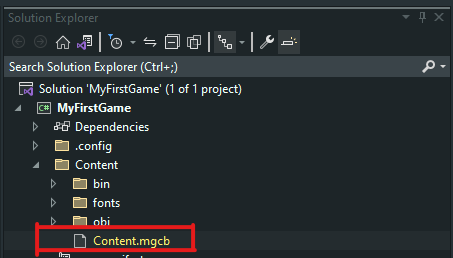
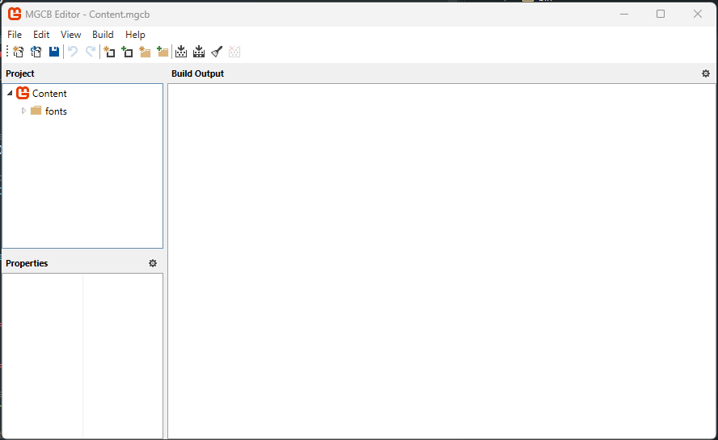
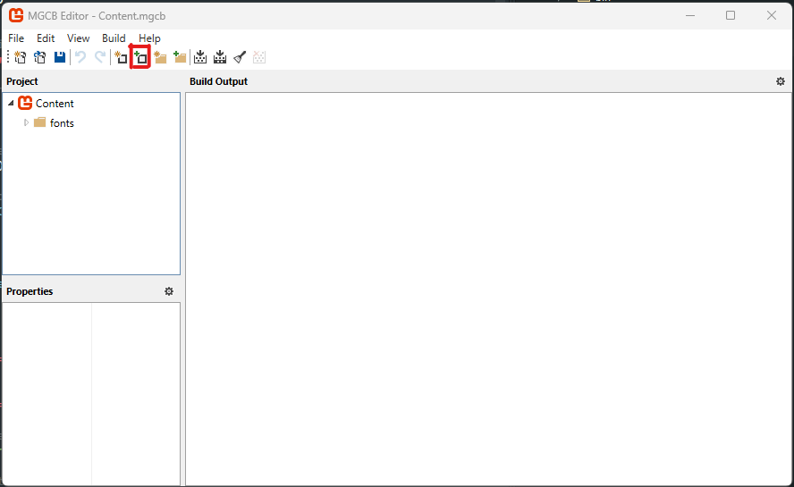
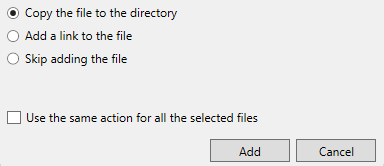
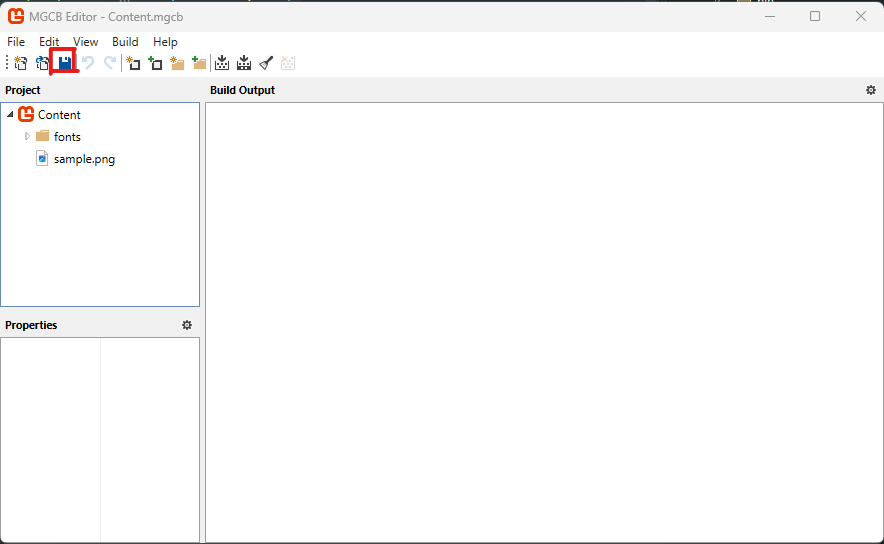
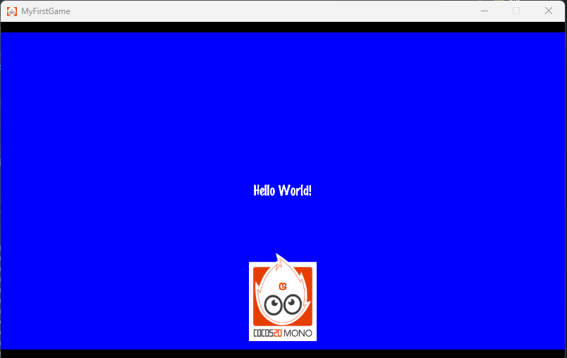

# Adding Content

Now that you have your first game running you might want to add some new content to it to make it more exciting.

This tutorial will go over adding content such as images or sounds to your game.

> For help with creating a project, please look at the [Create a New Project](/docs/developing/create-project.md) section of the Developing guide.

## MonoGame Content Builder Tool (MGCB Editor)

This tutorial assumes that you are using Visual Studio 2022 with its MonoGame extension or the MGCB Editor installed. If you are not using the extension, you will need to manually install and use the [MGCB Editor](https://docs.monogame.net/articles/tools/mgcb_editor.html).

This is technically optional, since you can edit the .mgcb files manually if you wish, but the editor is highly recommended for ease of use.

## Adding content

First, you will need some content for your game. For this tutorial, use the following image:

Copy the image to your machine by using right-click > Save Image As and save it somewhere locally with the name “sample.png”.

Now open up your game project and look at the Solution Explorer window. Expand the Content folder and open up Content.mgcb file by double-clicking on it.

You should now see the MGCB Editor window open up. If a text file opens instead, then right-click on Content.mgcb and select Open With, then select MGCB Editor in the list, click Set as Default and then click OK, then try again.

> If you do not see the MGCB Editor option when you right-click and select Open With, then please review MonoGame's [Tools documentation](https://docs.monogame.net/articles/tools/tools.html) for installing the MGCB Editor tool for your operating system.

Your game content is managed from this external tool. You can add content to your game in one of the following ways:

- Add Existing Item toolbar button
- Edit > Add > Existing Item... menu button
- right-click > Add > Existing Item... context menu

Make sure the "Content" MGCB file is selected to the left, then click the Add Existing Item toolbar button.

You should now be prompted to select a file. Select the "sample.png” image that you downloaded a moment ago. Once you have confirmed your selection, you will be asked whether to copy the file, add a link to it, or skip it. Make sure "Copy the file to the directory" option is selected and click Add.

Now click the Save toolbar button and close the MGCB Editor tool.

## Adding the content in your game

Now that you have added the asset to the Content project, it is time to load it into your game. First, open up the IntroLayer.cs class file and declare a new sampleSprite variable of type CCSprite in the IntroLayer class constructor, this will load your new image as a texture in memory and create a new easy to use sprite.

    public class IntroLayer : CCLayerColor
    {
        public IntroLayer()
        {
            var sampleSprite = new CCSprite("sample");
            ...
        }

Next, set a position for the sampleSprite

    sampleSprite.Position = new CCPoint(CCDirector.SharedDirector.WinSize.Center.X, 120);

Finally, just add the new sprite to the scene

    AddChild(sampleSprite);

When you are done it should look something like this

    public IntroLayer()
    {
        var sampleSprite = new CCSprite("sample");
        sampleSprite.Position = new CCPoint(CCDirector.SharedDirector.WinSize.Center.X, 120);

        // create and initialize a Label
        var label = new CCLabelTTF("Hello World!", "MarkerFelt", 22)
        {
            // position the label on the center of the screen
            Position = CCDirector.SharedDirector.WinSize.Center
        };

        // add the label as a child to this Layer
        AddChild(label);
        AddChild(sampleSprite);

        // setup our color for the background
        Color = new CCColor3B(Microsoft.Xna.Framework.Color.Blue);
        Opacity = 255;
    }

Now run the game. You should get the following:

