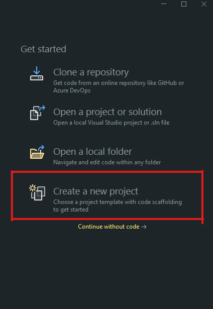
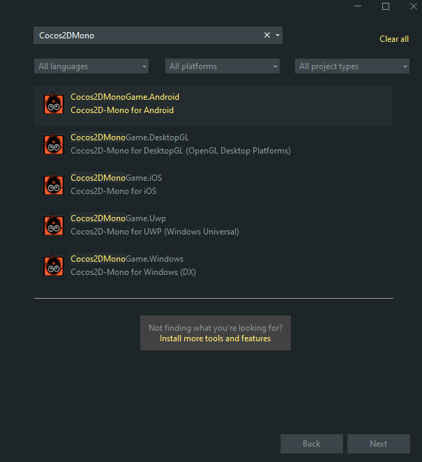
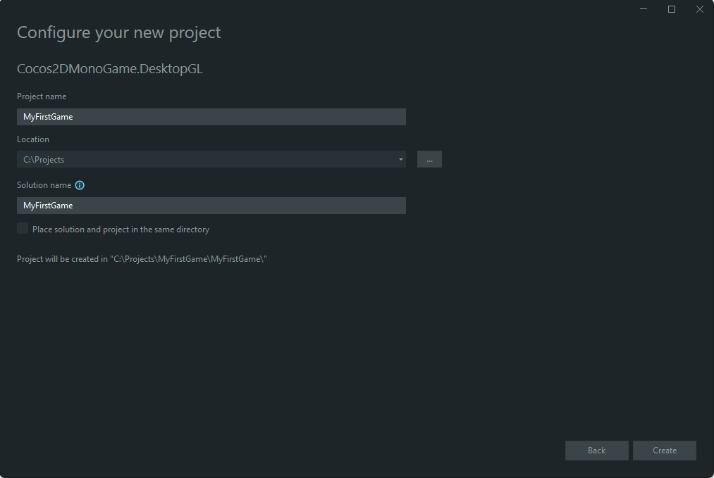
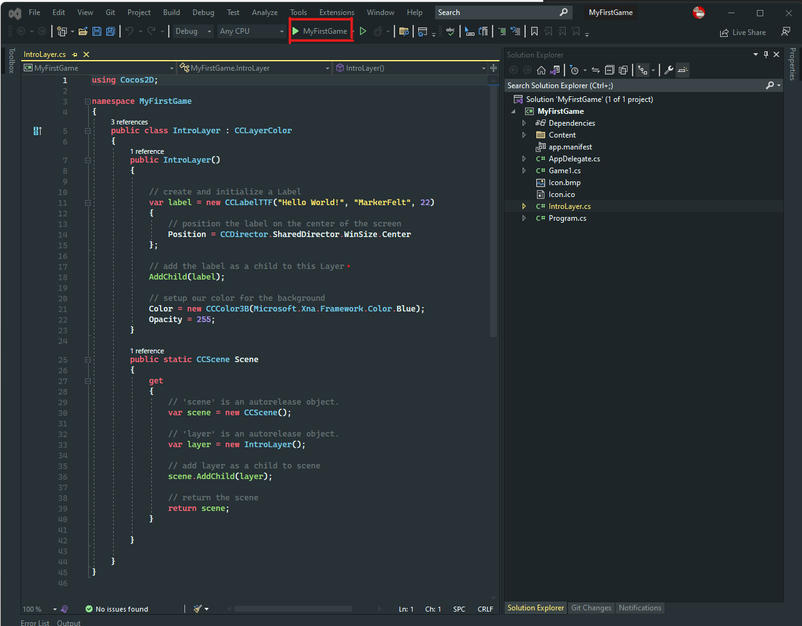
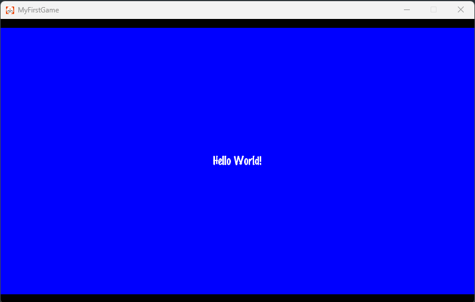

# Create a New Project

This guide will walk you through building a starter game with Cocos2D-Mono using Windows and Visual Studio 2022.

> This guide will walk you through using one of the Visual Studio Project Templates. You should have one installed before continuing.

Start Visual Studio 2022 and select `Create a new project`.

You should see the "Create a new project" dialog pop up. From here, simply search "Cocos2DMono", and then select the Project Template you would like to use (in this case we will be using the DesktopGL Project Template).

Next, type in a name for your project. For this tutorial, `MyFirstGame` will be used (note: project names cannot contain spaces). After you have entered the name, click on the ... button next to the Location text field and choose the folder you want to save the project in. Finally, click `Create` to create the project.

If everything went correctly, you should see a project named `MyFirstGame` open up like in the picture below. To run your game, simply press the big Play Button in the toolbar, or press F5.

You should now see your game window running.

